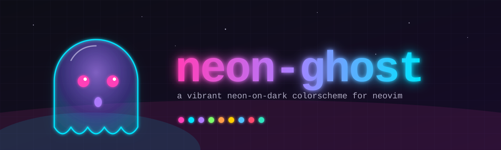

<p align="center">
  
</p>

# neon-ghost

## Requirements

- Neovim **0.9+**
- A `termguicolors`-capable terminal (graceful 256-color fallback is provided,
  but the experience is designed for truecolor)

## Install

### lazy.nvim

```lua
{
  "jamesGadoury/neon-ghost-theme",
  name = "neon-ghost",
  lazy = false,
  priority = 1000,
  config = function()
    require("neon-ghost").setup({
      -- transparent = true,
    })
    vim.cmd.colorscheme("neon-ghost")
  end,
}
```

### packer.nvim

```lua
use({
  "jamesGadoury/neon-ghost-theme",
  as = "neon-ghost",
  config = function()
    vim.cmd.colorscheme("neon-ghost")
  end,
})
```

## Configuration

`setup()` is optional — the defaults below are applied automatically.

```lua
require("neon-ghost").setup({
  transparent = false,               -- clear bg on Normal / floats
  terminal_colors = true,            -- populate :terminal colors

  styles = {
    comments  = { italic = true },
    functions = { bold = true },
    keywords  = {},
    types     = {},
    variables = {},
  },

  diagnostics = {
    undercurl  = false,              -- true = wavy underlines on errors
    background = false,              -- true = tinted bg on diagnostic lines
  },

  integrations = {
    treesitter       = true,
    lsp              = true,
    telescope        = true,
    cmp              = true,
    nvim_tree        = true,
    neo_tree         = true,
    gitsigns         = true,
    trouble          = true,
    lualine          = true,
    indent_blankline = true,
  },
})

vim.cmd.colorscheme("neon-ghost")
```

## Lualine

```lua
require("lualine").setup({
  options = { theme = "neon-ghost" },
})
```

## Palette

| Token     | Hex       | Used for |
|-----------|-----------|----------|
| `bg`      | `#0b0b14` | Normal background |
| `fg`      | `#e8e6ff` | Normal foreground |
| `pink`    | `#ff3fb8` | Keywords, control flow |
| `cyan`    | `#00e5ff` | Functions, methods |
| `purple`  | `#b07bff` | Operators, macros |
| `lime`    | `#7dff6a` | Strings, diff add |
| `orange`  | `#ff9e4a` | Numbers, constants |
| `yellow`  | `#ffcc00` | Types, classes |
| `blue`    | `#4fc3ff` | Variables, parameters |
| `red`     | `#ff486f` | Errors, diff delete |
| `teal`    | `#2ee6c0` | Hints, special, diff change-ish |

Full token set lives in [`lua/neon-ghost/palette.lua`](lua/neon-ghost/palette.lua).

## License

MIT
